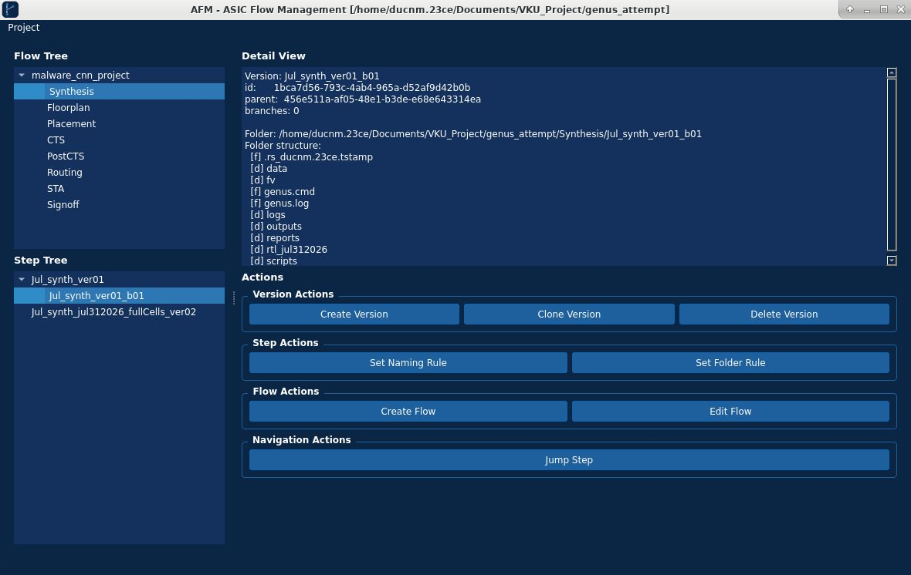
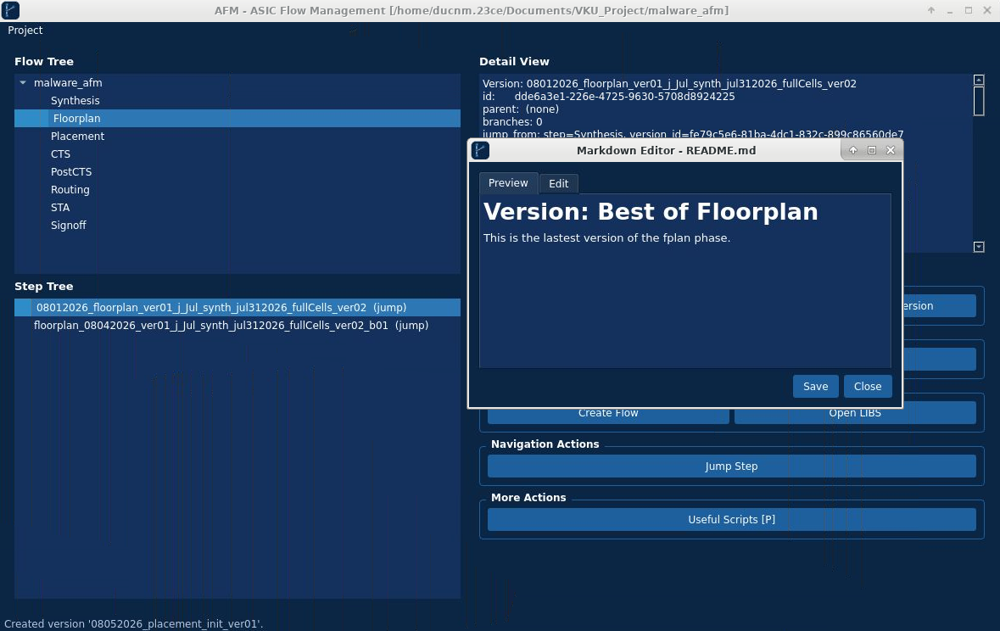

<p align="center">
  
</p>

<h1 align="center">AFM — ASIC Flow Management</h1>

<p align="center">
  Directory structure &amp; version management tool for the ASIC Physical Design flow.<br/>
  Not an EDA tool — AFM manages the <b>flow, version, branch, and data lineage</b> around your EDA tools.
</p>

<p align="center">
  
  
  
  
  
</p>

---

## Languages

- **[Vietnamese](README.md)**
- **[English](README_en.md)**

## Table of Contents

- [What is AFM?](#what-is-afm)
- [Key Features](#key-features)
- [Screenshots](#screenshots)
- [Project Structure](#project-structure)
- [Installation](#installation)
- [Quick Start](#quick-start)
- [Data Model](#data-model)
- [Roadmap](#roadmap)
- [Contributing](#contributing)
- [Developer](#developer)
- [License](#license)

---

## What is AFM?

**AFM (ASIC Flow Management)** is a directory and version control tool specifically designed for the ASIC Physical Design flow (Import → Floorplan → Placement → CTS → Routing → STA → Signoff...).

In a real-world ASIC project, each step is often executed repeatedly with different parameters, generating dozens or hundreds of output directories without any standard convention. This makes it difficult to trace "which version was generated from which" or "which CTS output was used for this Route run." AFM solves this exact problem by standardizing:

- The directory structure of each step
- Version naming conventions
- The cloning/branching of a version for parallel experimentation
- The transfer of data between steps ("jump step"), while recording the data lineage

AFM **does not run** Innovus, OpenROAD, PrimeTime, or any other EDA tool — it only manages the environment "around" those tools: directories, versions, and their relationships.

## Key Features

| # | Feature | Description |
|---|---|---|
| **F1** | **Create Flow** | Initializes a new project: creates `project_config.yaml`, the `LIBS/` directory, and all step folders according to the defined flow. |
| **F2** | **Version Naming Rule** | Customizes version naming conventions using 3 components (`date` / `name` / `version`), allowing you to toggle and sort them as desired. |
| **F3** | **Step Folder Rule** | Defines mandatory and optional subdirectories within each version (`data` and `outputs` are always required). |
| **F4** | **Create Version** | Creates a new version within a step, auto-generates the name based on rules, assigns a UUID, and builds the standard directory structure. |
| **F5** | **Clone Version** | Clones an entire version into a new branch (e.g., `_bXX`), maintaining the parent ↔ branch relationship. |
| **F6** | **Jump Step** | Transfers the `outputs/` of the current version to the `data/` of a new version in the next step, recording the lineage (`jump_from` / `jump_to`). |

Additionally:

- **Intuitive GUI (PyQt5)**: Flow Tree, Step Tree, Detail View, Actions Panel — click to view, double-click to open directories in the file explorer, right-click for quick actions.
- **Full CLI**: All operations can be run headless, making it highly suitable for scripting and CI pipelines.
- **CentOS 7 / Rocky Linux Compatible**: Pure Python 3.6+ codebase, avoiding newer syntax (`from __future__ import annotations`, PEP 604/585...) to ensure seamless execution on distros using default Python 3.6 environments.

## Screenshots

<p align="center">
  
</p>
<p align="center"><i>
Main Interface: Flow Tree + Step Tree (Left) · Detail View + Actions Panel (Right)
</i></p>

<p align="center">
  
</p>
<p align="center"><i>
Popup Interface: Detail Version Window
</i></p>

## Project Structure

```
afm_project/
├── afm/
│   ├── models.py             # ProjectConfig, StepConfig, Version, NamingRule, FolderRules
│   ├── yaml_io.py            # YAML read/write operations
│   ├── project_manager.py    # F1 Create Flow, F3 Step Folder Rule
│   ├── step_manager.py       # F2 Naming Rule, version/branch bookkeeping
│   ├── naming.py             # Generate version folder names + clone/jump postfixes
│   ├── version_manager.py    # F4 Create Version, F5 Clone Version, F6 Jump Step
│   ├── tree.py               # Render Flow Tree / Step Tree in text format (CLI)
│   ├── cli.py                # Entry point `afm -init` + headless subcommands
│   └── gui/
│       ├── app.py            # Main GUI application (PyQt5)
│       └── assets/           # Application icons/avatars
├── docs/
│   └── screenshot.png
├── tests/
│   └── test_core.py          # Unit tests for F1–F6
├── install.sh                # Automated installation script (venv + afm-env alias)
├── pyproject.toml / setup.py
├── INSTALL.md                # Detailed installation guide
└── README.md
```

## Installation

```bash
unzip afm_source_code.zip -d afm_project
cd afm_project
ls
# afm/  tests/  pyproject.toml  README.md
```

```bash
python3 -m venv .venv
source .venv/bin/activate       # Linux/macOS
# .venv\Scripts\activate.bat    # Windows (if needed)
```

```bash
chmod +x install.sh
./install.sh
```

For the complete guide (covering CentOS 7, Rocky Linux, Ubuntu, macOS, and troubleshooting), please refer to **[INSTALL.md](INSTALL.md)**.

## Quick Start

```bash
# Activate the environment (after running install.sh)
afm-env

# Launch GUI (follow the standard flow: cd into the project root then type afm -init)
cd /path/to/project_root
afm -init

# Alternatively, use the headless CLI
afm --path ./RISCV_PKL init --name RISCV_PKL     --steps Import,Floorplan,Placement,CTS,PostCTS,Routing,STA,Signoff

afm --path ./RISCV_PKL create-version CTS cts        # F4
afm --path ./RISCV_PKL clone-version CTS <version_id> # F5
afm --path ./RISCV_PKL jump CTS <version_id> PostCTS  # F6
afm --path ./RISCV_PKL tree --step CTS                # View version tree
```

## Data Model

```yaml
# project_config.yaml
project_name: RISCV_PKL
created_at: 2026-07-31
step_order: [Import, Floorplan, Placement, CTS]
folder_rules:
  required: [data, outputs]
  optional: [scripts, logs, reports]
```

```yaml
# <step>/step_config.yaml
step_name: CTS
version_name_rule:
  components: [date, name, version]
  order: [date, name, version]
versions:
  - id: uuid-001
    name: Jul_cts_ver01
    parent: null
    branches: [uuid-002]
    jump_from: null
    jump_to: [{step: PostCTS, version_id: uuid-010}]
```

## Roadmap

- [x] F1–F6 core engine + unit tests
- [x] PyQt5 GUI (Flow Tree / Step Tree / Detail View / Actions Panel)
- [x] Full headless CLI for scripting/CI integration
- [ ] **Execution Layer** — Run Cadence (or other EDA) tools directly from AFM
- [ ] **Analysis** — Compare WNS/TNS/area/power metrics across different versions
- [ ] **More**

## Contributing

All contributions, bug reports, and feature requests are welcome! Please open an issue or submit a pull request on the project's repository.

## Developer

Developed and maintained by **ducnm153**.

<p align="center">
  
</p>

## License

No official license has been determined for this project yet — update this section according to internal/company distribution policies before making the repository public.
